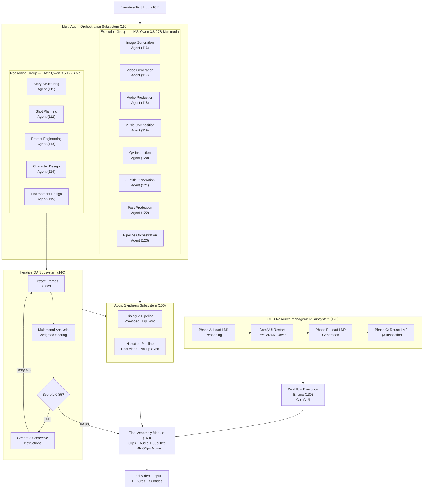
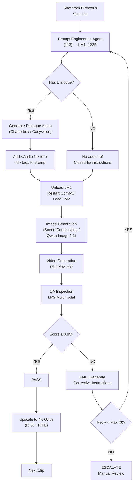
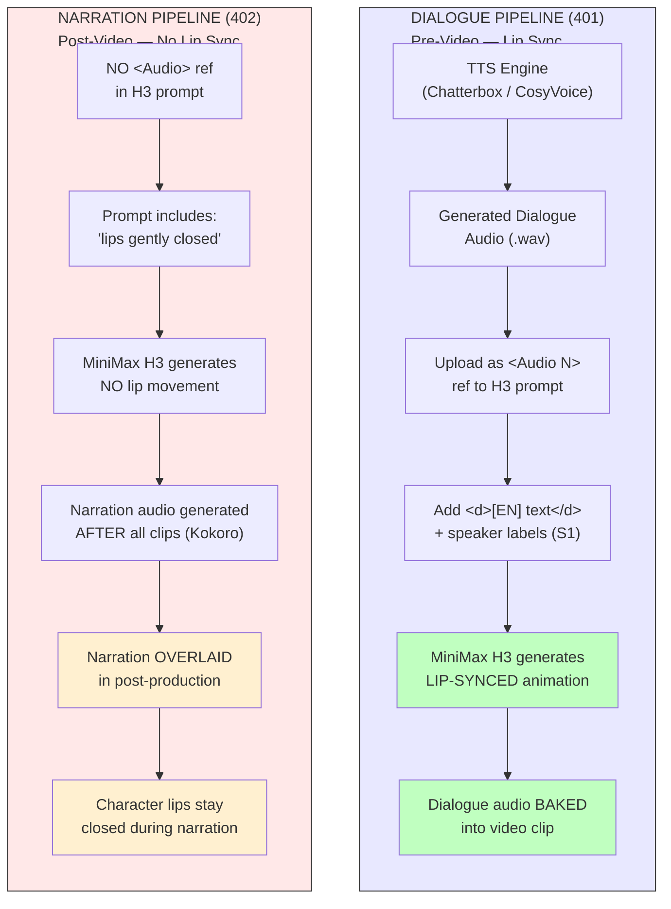
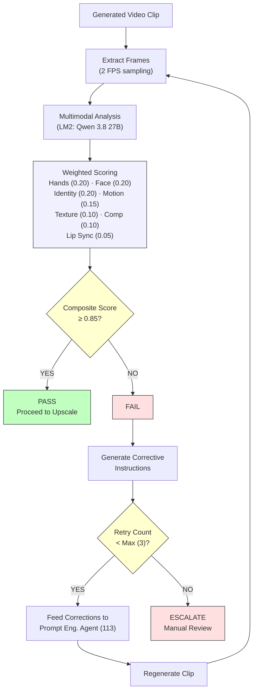

# Patent Diagrams — Mermaid Source

> Editable diagrams for all 5 patent figures.
> Render at: https://mermaid.live or any Mermaid-compatible editor.

---

## Figure 1 — System Architecture Overview

---

## Figure 2 — Per-Clip Production Loop Flowchart

---

## Figure 3 — Three-Phase GPU Memory Allocation Timeline

```mermaid
gantt
    title GPU VRAM Allocation per Clip (32 GB Total)
    dateFormat X
    axisFormat %s

    section Phase A — Reasoning
    LM1 Qwen 3.5 122B (~27 GB GPU + RAM offload) :a1, 0, 30

    section Swap
    Unload LM1 + Restart ComfyUI (free cache) :crit, s1, 30, 35

    section Phase B — Generation
    LM2 Qwen 3.8 27B (~20 GB)     :b1, 35, 65
    ComfyUI + H3 Model (~10 GB)   :b2, 35, 65

    section Phase C — QA (No Swap!)
    LM2 Qwen 3.8 27B REUSED (~20 GB) :done, c1, 65, 85
```

```mermaid
block-beta
    columns 5

    block:phaseA["Phase A: REASONING"]:2
        LM1["LM1: Qwen 3.5 122B<br/>~27 GB GPU + RAM offload"]
    end

    block:swap["SWAP"]:1
        RESTART["Restart ComfyUI<br/>Free VRAM cache"]
    end

    block:phaseB["Phase B: GENERATION"]:1
        LM2B["LM2: 27B<br/>~20 GB"]
        COMFY["ComfyUI+H3<br/>~10 GB"]
    end

    block:phaseC["Phase C: QA (No Swap!)"]:1
        LM2C["LM2: 27B REUSED<br/>~20 GB"]
        VISION["Vision analysis<br/>Same model"]
    end

    style phaseA fill:#d0d0ff
    style swap fill:#ffe0e0
    style phaseB fill:#c0ffc0
    style phaseC fill:#c0ffc0
```

---

## Figure 4 — Differentiated Audio-Visual Synchronization

---

## Figure 5 — Iterative Quality Assurance Feedback Loop

